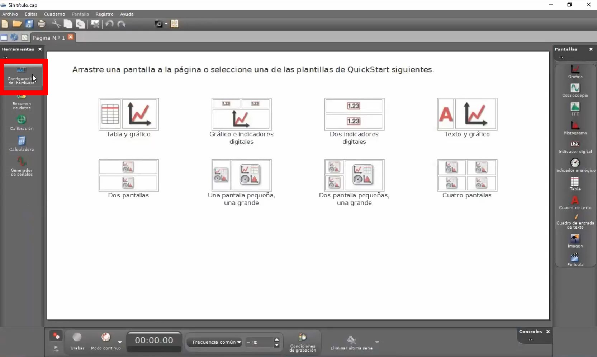

# Toggler Theory
We'd like a better menu from which we can select the sentence pair we want to study. We will now create this menu along with some cool functionalities.

## (1) Initial files
We'll use this HTML template.
```html
<!doctype html>
<html>
  <head>
    <meta charset="utf-8" />
    <meta name="viewport" content="width=device-width" />
    <link href="toggler.css" rel="stylesheet" />
  </head>
  <body>
    <script src="toggler.js"></script>
  </body>
</html>
```

